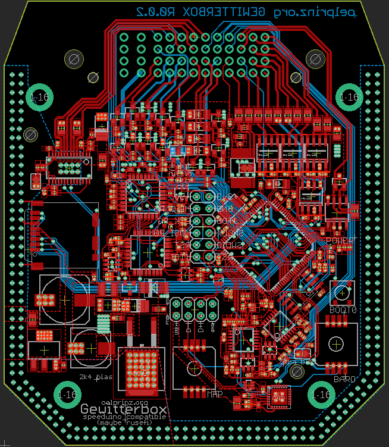
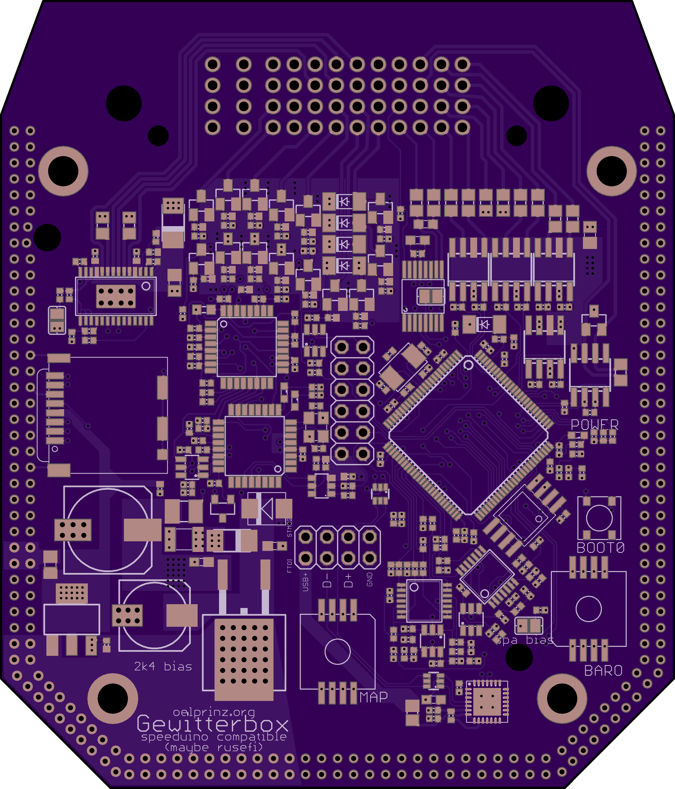
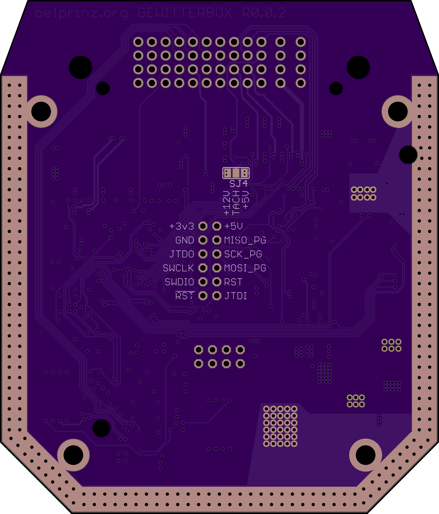
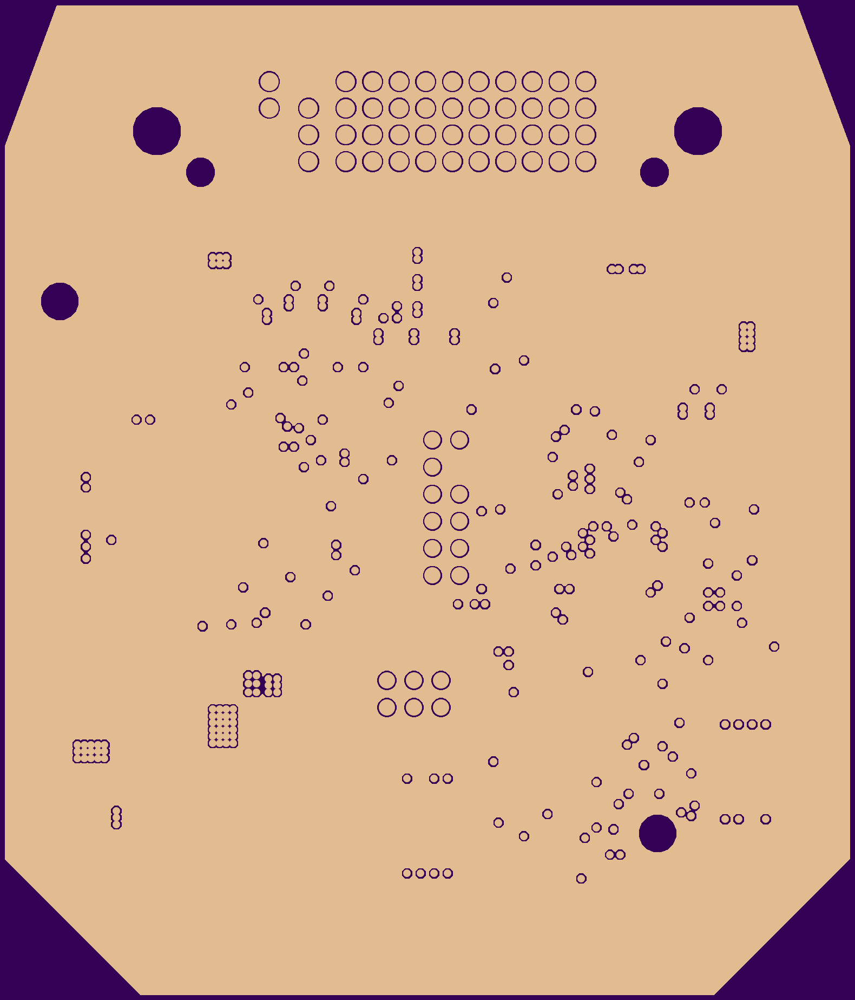
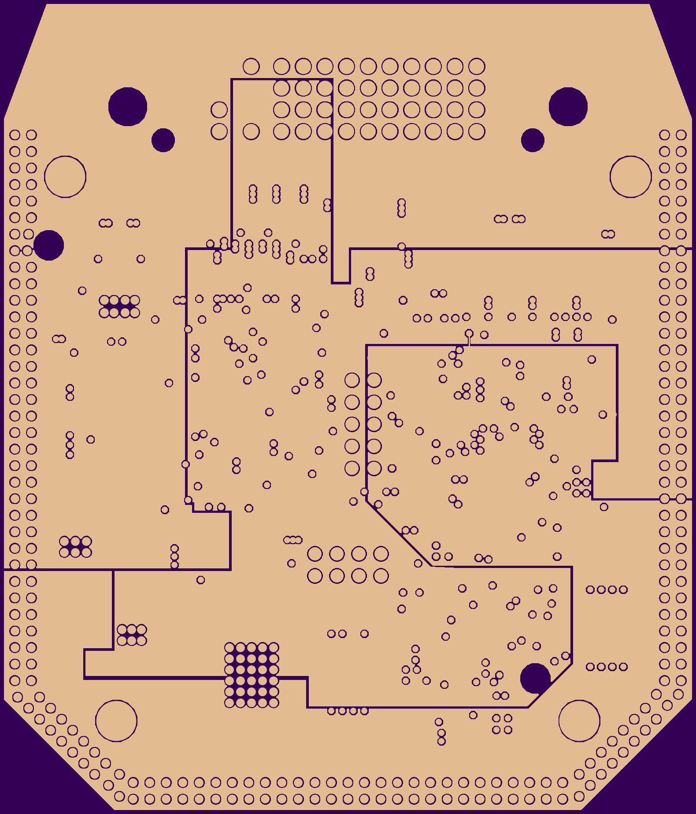
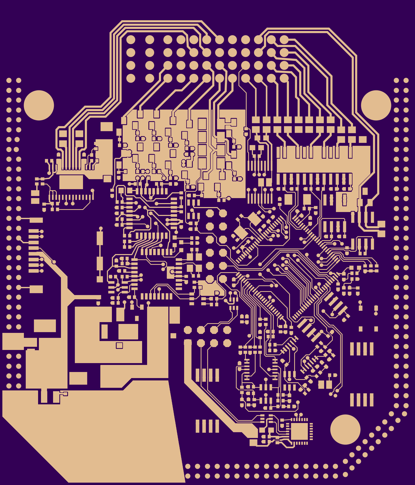
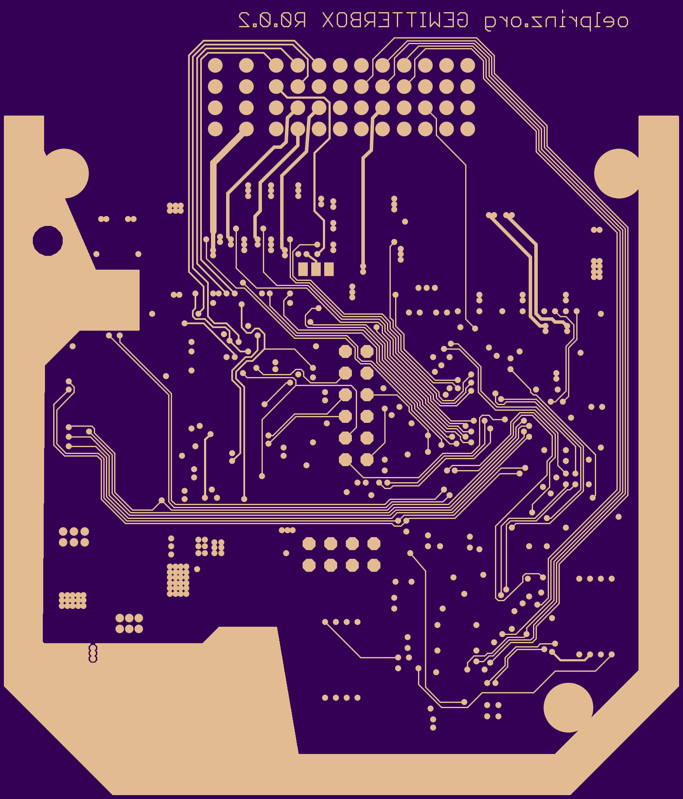
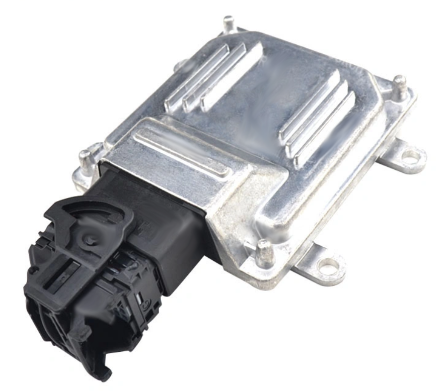
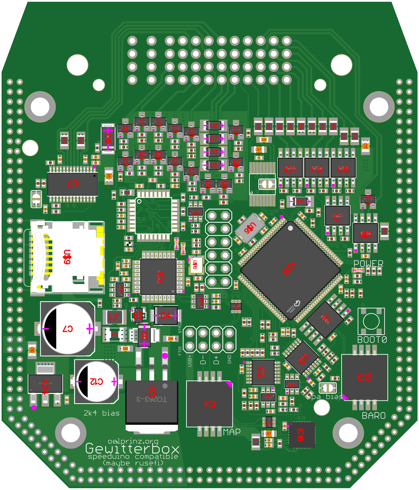
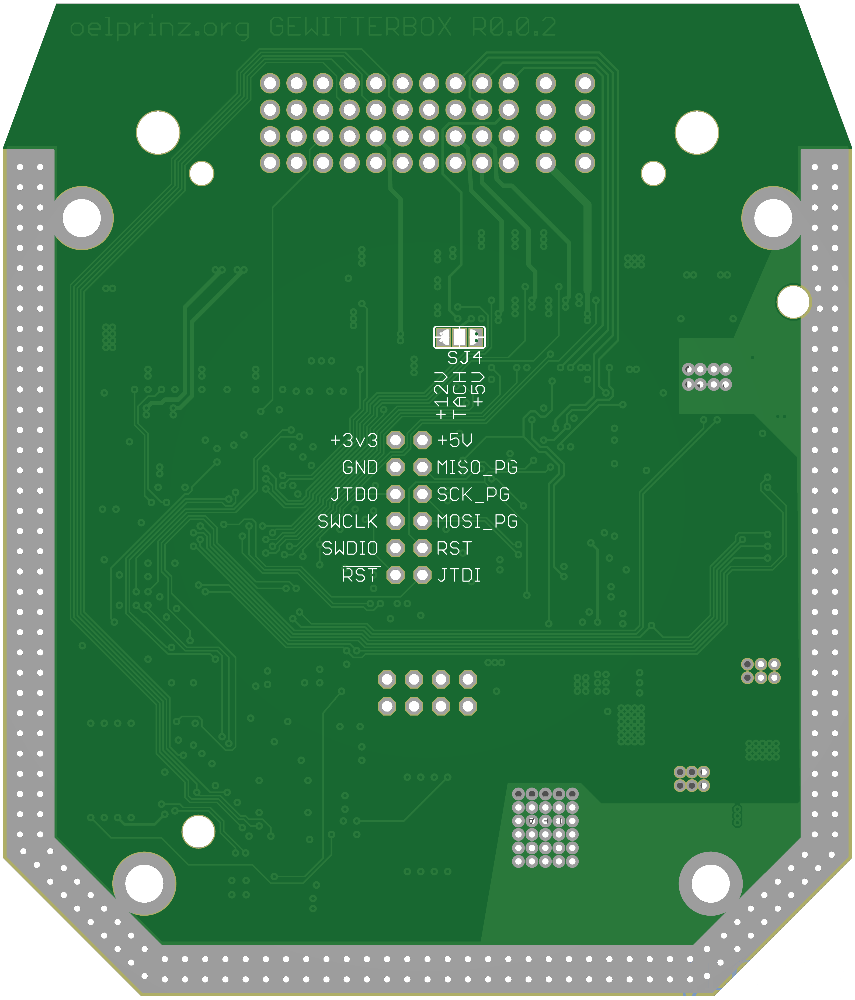

# Gewitterbox - V0.0.2 - second draft 
 
low-cost and small-sized ECU for speeduino firmware (Rev0.0.2 80 x 94 mm) 
Integrated Wideband Lambda Controller with Bosch CJ125 and LSU 4.9 
4-Layer highly integrated design - hand soldering possible but only recommended to people with really experienced soldering skills.  Hardware is optimized for assembly by professional assembly manufacturer 
supports 8 cylinder full sequential 

8 high impedance injectors 
8 active ignition coils 
1 crankshaft sensor with MAX9926 VR-conditioner (optional Hall Input without MAX9926) 
1 hall input for camshaft sensor 
7 analog inputs: CLT, IAT, TPS, BAT, LMM, MAP, Spare 0-5V with optional bias resistor 
1 baro sensor MPXH6115A/MPXHZ6250A/MPXH6300A/MPXH6400A 
1 MAP sensor MPXH6115A/MPXHZ6250A/MPXH6300A/MPXH6400A 
1 digital input for disco swaggering (aka. launch control) 

Onboard Wideband Lambda Controller with Bosch CJ125 (LSU 4.9) 

1 fuel pump out 
1 idle valve out 
1 tacho out (5/12V) 
1 boost out 
1 fan out 
1 idle stepper motor out 

USB programming interface with CP2102 

16.11.2022: First draft V0.0.1 - More infos coming soon.... 
13.03.2023: Second draft V0.0.2 - changed wideband lambda controller to same design as in Blitzbox 

[Link to the original speeduino project](https://www.speeduino.com "speeduino homepage") 
 
Quick link to Rev0.0.2 schematic: https://github.com/oelprinz-org/Gewitterbox/blob/master/hardware/Rev0.0.2/schematics_gewitterbox_V0.0.2.pdf  

Quick link to Rev0.0.2 iBOM: http://oelprinz.org/products/Gewitterbox/hardware/V0.0.2/iBOM/ibom.html  

   
  
   
  
  
  
  
   
   
   

 

   

